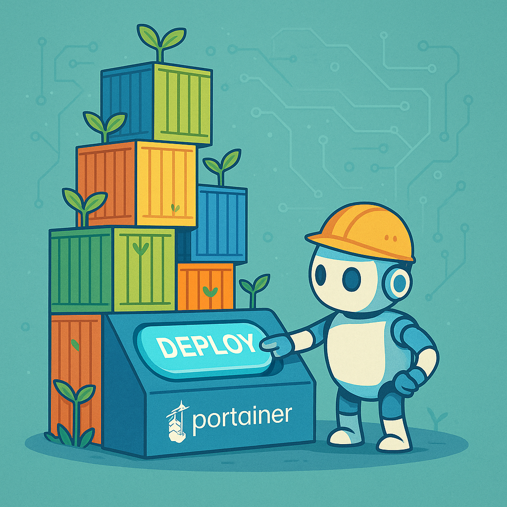

# День 5 — «Кнопка-клац, и всё взлетело! 🚀»

> *«Мы знали, что будет сложно, но не настолько же удобно…»*

Пятая итерация приключений InkLumin принесла нам ещё больше лоска, ещё меньше кривых углов и — внимание — **Portainer**.  
Теперь развернуть приложение можно «по клику», что почти превращает DevOps-танцы с бубном в лёгкую йогу. А пока контейнеры тихо лакомятся сервером, рассказываем, что нового отшлифовали.

---

## 🚀 Что сделали

| 🛠️ Фикс/фича                                        | Коротко о главном |
|------------------------------------------------------|------------------|
| **Шапка без побега текста**                          | Длинные заголовки на мобилке больше не убегают во вторую строку, ломая карму верстальщика. |
| **Код в тексте ≠ каша**                              | Форматирование вставок `code` в текстовом параметре теперь аккуратное. Да-да, InkLumin — уже не только для писателей, но и для тех, кому HTML & CSS снятся по ночам. |
| **Список элементов Базы Знаний пощичен**             | Редко используемые действия спрятали во всплывающее меню. Интерфейс на телефоне дышит свободнее, а пальцы нажимают точнее. |
| **Документация подружилась с соцсетями**             | Заглушки «[link]» ушли в прошлое — теперь настоящие VK, Дзен и Telegram. Подписывайтесь, пока мы не выпилили кружочки! |
| **Две шапки — одна галочка**                         | Для элемента Базы знаний можно выбрать: **крупная** шапка или **сокращённая**. Переключается чекбоксом в свойствах блока. |
| **Редактирование изображения — в самом изображении** | Иконки действий переехали внутрь превью-картинки. Больше никаких непонятных кнопок внизу списка. |
| **Крупные переключатели разделов**                   | В карточке элемента БЗ выросли кнопки навигации; промахнуться теперь сложнее, чем найти баг в prod в пятницу. |
| **Portainer inside**                                 | Одним кликом раскатываем свежую версию на сервер: контейнеры по стойке смирно, dev-сердца спокойны. |

---

## 🤔 P.S.

* **CI/CD-гуру** уже закатывают глаза: «Ну, Portainer, и что?».  
  Зато мы нажали — *клик* — и пошли пить чай.
* **Кто-то спросит про авто-тесты?** Конечно, будут!  
  Сразу после того, как прикрутим механическую руку, которая будет нажимать F5 без устали.

---

С уважением,  
**Владимир и команда работящих железяк** 🤖🔧
