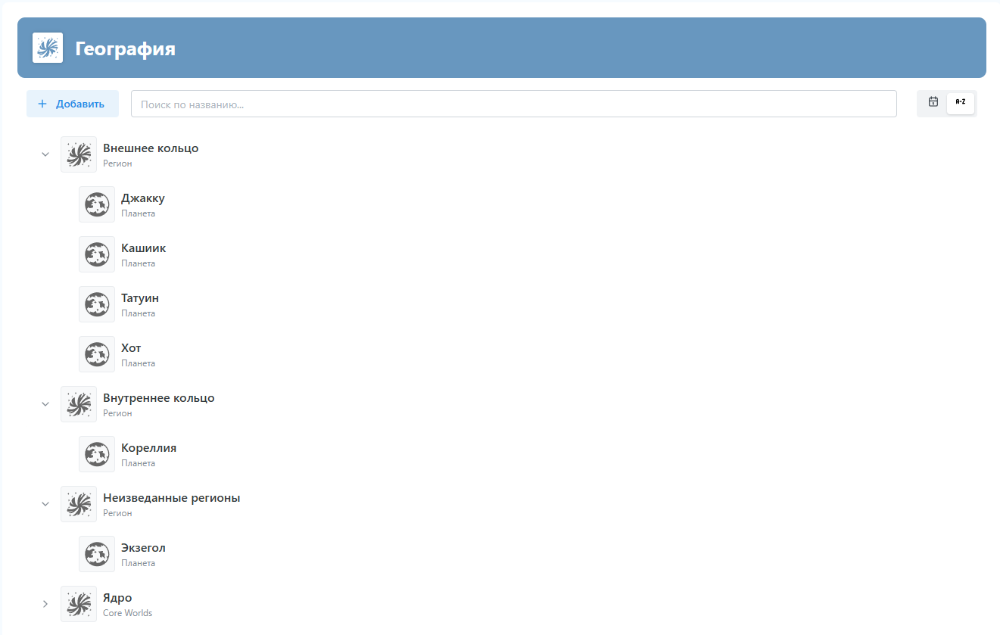

# День 6 — «Деревья растут, блоки ветвятся! 🌳»

> *«Кто бы мог подумать, что один чек‑бокс способен породить целый лес…»*

Мы знали, что база знаний — живой организм. Но теперь она официально получила ветви, листья и мощные корни — добро пожаловать в **иерархический режим**! Пока птицы распевают JSON‑серенады в кронах, делимся свежими апгрейдами.

---

---

## 🚀 Что сделали

| 🛠️ Фикс/фича | Коротко о главном                                                                                                                                                                               |
|--------------|-------------------------------------------------------------------------------------------------------------------------------------------------------------------------------------------------|
| **Древовидное отображение** | Новый чек‑бокс в редакторе блока включает режим «Лес»: элементы Базы Знаний можно складывать в родитель‑вложенные цепочки, перемещать между ветками и группами. Таскаем, растягиваем, любуемся. |
| **Чистый список элементов** | В списке элементов Базы Знаний инлайн‑иконки спрятаны во всплывающее меню, а сами иконки элементов поселились в аккуратные контейнеры. Меньше визуального шума — больше Zen.                    |
| **Конфигуратор похудел** | Редактирование структуры блока стало воздушнее: секцию со склонениями и множественным числом отправили под спойлер. При желании — раскроете и посклоняете.                                      |
| **«Дочерние» → «Вложенные»** | Терминологический ребрендинг: загадочные «дочерние блоки» теперь везде зовутся **вложенными**. Потому что вложенность — понятно, а семья‑блок‑дети‑алиментные‑обязательства… тяжеловато.        |

---
Вот так, например, можно использовать иерархическое отображение:

---
## 🤔 P.S.

*Внимание, ботанический факт:* если слишком много перетаскивать узлы в иерархии, можно услышать тихий хруст веточек — это CSS‑flex с усилием приспосабливается под ваш перфекционизм.  
А мы, тем временем, уже поливаем следующий росток фичи: экспорт произведения в формат WORD 

---

С уважением,  
**Владимир и команда работящих железяк** 🤖🔧

